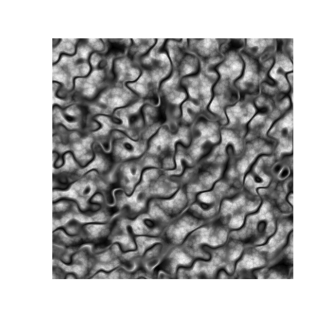

<!-- README.md is generated from README.Rmd. Please edit that file -->
ambient 
========================================================

[](https://travis-ci.org/thomasp85/ambient)
[](https://ci.appveyor.com/project/thomasp85/ambient)
[](https://CRAN.R-project.org/package=ambient)
[](https://CRAN.R-project.org/package=ambient)

`ambient` is a an R package that provides access to the
[FastNoise](https://github.com/Auburns/FastNoise) C++ library for
generating noise. As such it provides fast generation of perlin, value,
cubic, and worley noise in 2 and 3 dimensions, as well as simplex and
white noise in 2, 3, and 4 dimensions. Further, it provides pattern
generators and other utilities that can be used for modifying and
working with noise.

Most of the noise patterns can be generated as fractals as well with
support for fbm, billow and rigid-multifractal, and can optionally be
pertubed.

There’s not much more to it. If you are in need of a noise generator
`ambient` is your friend, if not you probably shouldn’t care.

Installation
------------

ambient can be installed from CRAN using `install.packages('ambient')`,
or you may get the development version from github using devtools:

``` r
# install.packages('devtools')
devtools::install_github('thomasp85/ambient')
```

Examples
--------

ambient provides a direct interface to the FastNoise functions by
requesting a matrix/array of noise values, with a range of settings for
pertubation and fractals:

``` r
library(ambient)
plot_raster <- function(mat) {
  mat <- (mat - min(mat)) / diff(range(mat))
  plot(as.raster(mat))
}
simplex <- noise_simplex(c(500, 500), pertubation = 'normal', 
                         pertubation_amplitude = 40)
plot_raster(simplex)
```


much more powerful, however, is the tidy interface that allows full
control of how the values should be calculated and combined:

``` r
library(dplyr)
#> 
#> Attaching package: 'dplyr'
#> The following objects are masked from 'package:stats':
#> 
#>     filter, lag
#> The following objects are masked from 'package:base':
#> 
#>     intersect, setdiff, setequal, union

long_grid(x = seq(0, 10, length.out = 1000), 
          y = seq(0, 10, length.out = 1000)) %>% 
  mutate(
    x1 = x + gen_simplex(x, y) / 2, 
    y1 = y + gen_simplex(x, y) / 2,
    worley = gen_worley(x, y, value = 'distance', seed = 5),
    worley_frac = fracture(gen_worley, ridged, octaves = 8, x = x, y = y, 
                           value = 'distance', seed = 5),
    full = blend(normalise(worley), normalise(worley_frac), gen_spheres(x1, y1))
  ) %>% 
  as.raster(value = full) %>% 
  plot()
```


