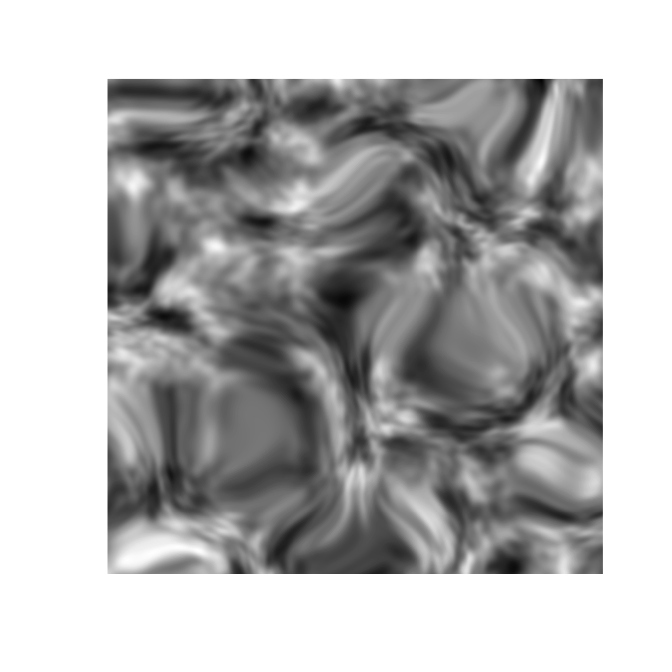

<!-- README.md is generated from README.Rmd. Please edit that file -->
ambient 
========================================================

[](https://travis-ci.org/thomasp85/ambient)
[](https://ci.appveyor.com/project/thomasp85/ambient)
[](https://CRAN.R-project.org/package=ambient)
[](https://CRAN.R-project.org/package=ambient)

`ambient` is a an R package that provides access to the
[FastNoise](https://github.com/Auburns/FastNoise) C++ library for
generating noise. As such it provides fast generation of perlin, value,
cubic, and worley noise in 2 and 3 dimensions, as well as simplex and
white noise in 2, 3, and 4 dimensions. Further, it provides pattern
generators and other utilities that can be used for modifying and
working with noise.

Most of the noise patterns can be generated as fractals as well with
support for fbm, billow and rigid-multifractal, and can optionally be
pertubed.

There’s not much more to it. If you are in need of a noise generator
`ambient` is your friend, if not you probably shouldn’t care.

Installation
------------

ambient can be installed from CRAN using `install.packages('ambient')`,
or you may get the development version from github using devtools:

``` r
# install.packages('devtools')
devtools::install_github('thomasp85/ambient')
```

Examples
--------

Following is a couple of examples of the noise patterns possible with
`ambient`:

``` r
library(ambient)
plot_raster <- function(mat) {
  mat <- (mat - min(mat)) / diff(range(mat))
  plot(as.raster(mat))
}

# Simplex
plot_raster(noise_simplex(c(500, 500)))
```



``` r

# Simplex - No fractality
plot_raster(noise_simplex(c(500, 500), fractal = 'none'))
```


``` r

# Worley (cellular)
plot_raster(noise_worley(c(500, 500)))
```


``` r

# Worley - with pertubation
plot_raster(noise_worley(c(500, 500), pertubation = 'normal', pertubation_amplitude = 40))
```


